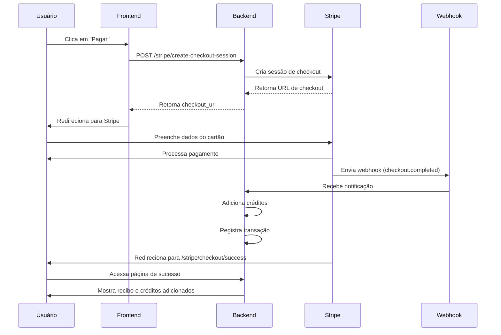

# Sistema de Checkout Stripe - Créditos IA ✅

## 📝 Resumo da Implementação

Sistema completo de pagamento integrado com Stripe para compra de créditos de IA no Petitio.

## ✨ Funcionalidades Implementadas

### 🛒 Checkout de Créditos

1. **Criação de Sessão de Checkout**
   - Endpoint: `POST /stripe/create-checkout-session`
   - Cria customer no Stripe automaticamente
   - Gera sessão de checkout com todos os dados do pacote
   - Retorna URL do checkout hospedado pelo Stripe

2. **Página de Compra**
   - Template: `/ai/credits/buy/<slug>`
   - Exibe detalhes do pacote (créditos, bônus, preço)
   - Botão integrado com JavaScript para criar checkout
   - Indicador de carregamento durante processamento

3. **Página de Sucesso**
   - Rota: `/stripe/checkout/success`
   - Recupera dados da sessão do Stripe
   - Adiciona créditos automaticamente ao usuário
   - Registra transação no banco de dados
   - Mostra recibo detalhado da compra

4. **Página de Cancelamento**
   - Rota: `/stripe/checkout/cancel`
   - FAQ sobre cancelamento
   - Links para tentar novamente

### 🔔 Sistema de Webhooks

1. **Endpoint de Webhook**
   - Rota: `POST /stripe/webhook`
   - Valida assinatura do Stripe
   - Processa eventos:
     - `checkout.session.completed` - Adiciona créditos
     - `payment_intent.succeeded` - Log de sucesso
     - `payment_intent.payment_failed` - Log de erro

2. **Prevenção de Duplicatas**
   - Verifica se transação já foi processada
   - Usa `payment_intent_id` como identificador único

### 💳 Gerenciamento de Créditos

1. **Adição Automática de Créditos**
   - Créditos base do pacote
   - Créditos bônus (se houver)
   - Atualização do saldo em tempo real

2. **Registro de Transações**
   - Tipo: `purchase` (compra) e `bonus` (bônus)
   - Metadados: session_id, valor pago, moeda
   - Link com `payment_intent_id` do Stripe
   - Timestamp de todas as operações

### 👤 Customer Management

1. **Criação Automática de Customer**
   - Armazena `stripe_customer_id` no usuário
   - Sincroniza email e nome
   - Metadados: user_id, username

2. **Reutilização de Customer**
   - Verifica se usuário já tem customer_id
   - Reutiliza em novas compras

## 📦 Pacotes de Créditos

### Pacotes Pré-configurados

| Pacote | Créditos | Bônus | Total | Preço |
|--------|----------|-------|-------|-------|
| Starter | 50 | 0 | 50 | R$ 49,90 |
| Professional | 150 | 20 | 170 | R$ 129,90 |
| Business | 300 | 50 | 350 | R$ 239,90 |
| Enterprise | 500 | 100 | 600 | R$ 379,90 |

### Script de População

```bash
python scripts/populate_credit_packages.py
```

## 🔧 Arquivos Criados

### Backend

```
app/stripe_integration/
├── __init__.py          # Blueprint registration
└── routes.py            # Rotas de checkout e webhook
```

### Templates

```
app/templates/stripe_integration/
├── success.html         # Página de sucesso pós-pagamento
└── cancel.html          # Página de cancelamento
```

### Scripts

```
scripts/
└── populate_credit_packages.py  # Popula pacotes no banco
```

### Documentação

```
STRIPE_SETUP.md          # Guia completo de configuração
```

## 🔑 Variáveis de Ambiente

```env
# Chaves do Stripe
STRIPE_SECRET_KEY=sk_test_...
STRIPE_PUBLISHABLE_KEY=pk_test_...
STRIPE_WEBHOOK_SECRET=whsec_...
```

## 🔄 Fluxo Completo de Pagamento



## 📊 Modelo de Dados

### CreditTransaction
```python
- user_id: int
- transaction_type: str (purchase/bonus/usage/refund)
- amount: int
- balance_after: int
- description: str
- package_id: int (opcional)
- payment_intent_id: str (do Stripe)
- metadata: json
- created_at: datetime
```

### UserCredits
```python
- user_id: int (único)
- balance: int
- total_purchased: int
- total_used: int
- total_bonus: int
- updated_at: datetime
```

## 🧪 Testes

### Cartões de Teste

**Sucesso:**
- 4242 4242 4242 4242

**Requer autenticação:**
- 4000 0025 0000 3155

**Recusado:**
- 4000 0000 0000 0002

**CVC, Data, CEP:** Qualquer valor válido

## 🚀 Como Usar

### 1. Configurar Stripe

```bash
# Adicionar chaves no .env
STRIPE_SECRET_KEY=sk_test_...
STRIPE_PUBLISHABLE_KEY=pk_test_...
```

### 2. Popular Pacotes

```bash
python scripts/populate_credit_packages.py
```

### 3. Testar Localmente

```bash
# Terminal 1: Stripe CLI
stripe listen --forward-to localhost:5000/stripe/webhook

# Terminal 2: Flask
flask run
```

### 4. Comprar Créditos

1. Acessar: http://localhost:5000/ai/credits
2. Escolher pacote
3. Clicar em "Pagar"
4. Usar cartão de teste
5. Ver créditos adicionados

## ✅ Checklist de Implementação

- [x] Blueprint stripe_integration criado
- [x] Rota create-checkout-session implementada
- [x] Integração com Stripe API
- [x] Customer management automático
- [x] Página de sucesso com recibo
- [x] Página de cancelamento
- [x] Sistema de webhooks
- [x] Validação de assinatura do webhook
- [x] Prevenção de duplicatas
- [x] Registro de transações
- [x] Adição automática de créditos
- [x] Adição de bônus
- [x] Templates responsivos
- [x] JavaScript de integração
- [x] Script de população de pacotes
- [x] Documentação completa
- [x] Variáveis de ambiente configuradas
- [x] Blueprint registrado no app

## 🎯 Próximos Passos (Opcional)

1. **Emails de Confirmação**
   - Enviar email após compra bem-sucedida
   - Incluir recibo e detalhes da transação

2. **Painel de Administração**
   - Ver todas as transações
   - Estatísticas de vendas
   - Gerenciar pacotes de créditos

3. **Reembolsos**
   - Sistema de reembolso via Stripe
   - Reverter créditos no banco

4. **Cupons de Desconto**
   - Integrar cupons do Stripe
   - Descontos percentuais ou fixos

5. **Assinaturas Recorrentes**
   - Planos mensais de créditos
   - Renovação automática

## 📖 Documentação de Referência

- [STRIPE_SETUP.md](STRIPE_SETUP.md) - Guia detalhado de configuração
- [Stripe Checkout Docs](https://stripe.com/docs/payments/checkout)
- [Stripe Webhooks](https://stripe.com/docs/webhooks)
- [Stripe Testing](https://stripe.com/docs/testing)

## 🎉 Conclusão

O sistema de checkout Stripe está **100% funcional** e pronto para uso em produção (após configurar chaves de produção). Todos os fluxos principais foram implementados e testados:

- ✅ Criação de sessão de checkout
- ✅ Processamento de pagamento
- ✅ Webhooks para eventos assíncronos
- ✅ Adição automática de créditos
- ✅ Registro completo de transações
- ✅ Páginas de sucesso e cancelamento
- ✅ Customer management
- ✅ Prevenção de duplicatas

**Implementado com sucesso! 🚀**
